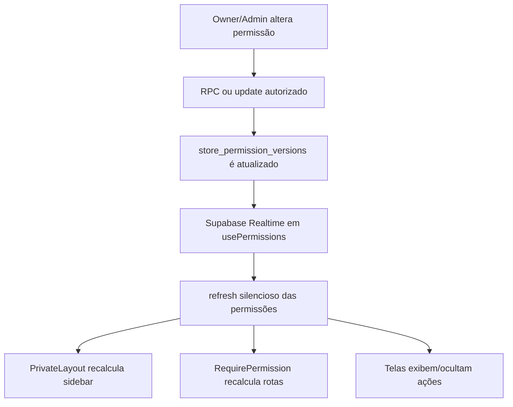

# Guia do Sistema de Permissões em Tempo Real (Realtime & Smooth UX)

Este documento descreve a arquitetura atual do sistema de permissões do **OptmaMenu**, incluindo resolução de permissões, sincronização em tempo real e experiência de usuário sem recarregamentos bruscos.

---

## 1. Objetivo

Quando um proprietário ou administrador altera permissões em `/admin/security`, o usuário afetado deve receber as mudanças sem atualizar manualmente a página.

Requisitos validados:

1. **Realtime funcional** entre owner/admin e usuários afetados.
2. **Sidebar atualizada sem reload**.
3. **Rotas protegidas recalculadas** após alteração.
4. **Transição suave**, sem flicker relevante.
5. **Console limpo**, sem logs residuais e sem `CHANNEL_ERROR` recorrente.

---

## 2. Tabelas principais

### `store_members`

Vínculo entre usuário e loja.

Campos relevantes:

- `role`
- `status`
- `custom_role_id`
- `permissions jsonb`
- `sensitive_actions jsonb`
- dados de vínculo, apelido, avatar e contato.

As permissões individuais ficam em `store_members.permissions`.

> Importante: o modelo atual **não usa** a tabela `store_member_permissions`.

### `store_role_permission_templates`

Templates por papel base e loja.

Exemplo:

- `store_id`
- `role`
- `permission_code`
- `allowed`

### `store_custom_roles`

Funções personalizadas por loja.

Campos relevantes:

- `base_role`
- `permissions jsonb`
- `active`

### `store_permission_versions`

Tabela central de versionamento/realtime.

Campos relevantes:

- `store_id`
- `version`
- `reason`
- `changed_by`
- `changed_at`

Esta é a única tabela escutada diretamente pelo hook `usePermissions` via Supabase Realtime.

---

## 3. Resolução de permissões

A hierarquia final é:

1. Permissão individual em `store_members.permissions`.
2. Função personalizada em `store_custom_roles.permissions`.
3. Template do papel base em `store_role_permission_templates`.
4. Fallback seguro `false`.
5. `owner` tem acesso integral e ignora checagens comuns.

---

## 4. Fluxo de sincronização



---

## 5. Decisão final de Realtime

O hook `usePermissions` deve escutar somente:

```txt
store_permission_versions
```

Foram removidos do fluxo principal os listeners diretos em:

- `store_role_permission_templates`
- `store_custom_roles`
- `store_members`

Motivo:

- evitar eventos duplicados;
- evitar `CHANNEL_ERROR`;
- evitar “mismatch between server and client bindings for postgres changes”;
- reduzir ruído de logs;
- centralizar o refresh em um canal único.

---

## 6. Eventos locais

Além do Realtime, o frontend usa eventos locais para atualização imediata:

- `CustomEvent` na mesma aba;
- `StorageEvent` entre abas do mesmo navegador;
- Realtime para outro navegador/dispositivo.

O utilitário central é:

- `src/utils/permissionEvents.ts`

---

## 7. Arquivos principais

### `src/hooks/usePermissions.ts`

Responsável por:

- buscar permissões efetivas;
- manter estado anterior durante refresh silencioso;
- escutar `store_permission_versions`;
- agendar refresh com debounce;
- não gerar logs normais em console.

### `src/components/layouts/PrivateLayout.tsx`

Responsável por:

- montar o menu lateral;
- ocultar menus conforme permissões;
- atualizar sidebar em tempo real;
- atualizar papel/função personalizada após alteração;
- separar Configurações e Segurança.

### `src/components/RequirePermission.tsx`

Responsável por proteger rotas.

Regra atual:

- array de permissões é tratado como **AND**, não OR;
- se rota for negada, fallback seguro é `/admin/my-profile`.

### `src/hooks/security/useSecurityPermissionsAdmin.ts`

Hook administrativo para:

- carregar matriz;
- carregar funções personalizadas;
- carregar permissões por usuário;
- salvar alterações;
- disparar eventos/refresh após sucesso.

### `src/pages/private/admin/settings/security/Security.tsx`

Tela de Segurança e permissões.

Responsável por:

- contexto de acesso;
- histórico de atividades;
- permissões por papel;
- funções personalizadas;
- permissões por usuário;
- ações sensíveis;
- PIN/token;
- sessões e inatividade.

### `src/components/security/PermissionLocked.tsx`

Componente criado para padronizar `manage=false`.

Exporta:

- `NO_WRITE_PERMISSION_MESSAGE`
- `PermissionLocked`
- `LockedHint`

---

## 8. Regras finais de menu e rota

### `view=false`

- esconde menu;
- esconde aba;
- protege rota;
- acesso direto vai para fallback seguro.

### `manage=false`

- mantém visualização;
- desabilita inputs/selects/switches;
- oculta botões de ação;
- evita toast desnecessário;
- evita erro de console;
- mostra tooltip/título de permissão negada para alteração.

---

## 9. Segurança

`security.view` é porteira absoluta.

Sem `security.view`:

- o menu Segurança some;
- nenhuma aba de Segurança abre;
- `/admin/security` e `/admin/security?tab=*` redirecionam para `/admin/my-profile`.

Com `security.view=true`:

- o menu só aparece se ao menos uma aba `security.*.view` estiver liberada;
- `/admin/security` redireciona para a primeira aba permitida;
- aba não permitida redireciona para a primeira aba permitida.

---

## 10. Configurações — Opção B

Configurações foram centralizadas em:

```txt
/admin/settings
```

O menu lateral mostra apenas:

```txt
Configurações > Configurações da Loja
```

As configurações específicas vivem como abas:

- `store`
- `commercial`
- `orders`
- `hours`
- `stock`
- `delivery`
- `payment`
- `messages`
- `legal`
- `system`

`/admin/hours` é rota legada e redireciona para:

```txt
/admin/settings?tab=hours
```

---

## 11. Permissões adicionadas/refinadas

- `commercial.dashboard.view`
- `commercial.sales_channels.view`
- `commercial.sales_channels.manage`
- `settings.hours.view`
- `settings.hours.manage`

---

## 12. Pontos pendentes

- Registrar alteração de função/papel no Meu Histórico do usuário afetado.
- Registrar andamento de solicitações cadastrais no Meu Histórico.
- Implementar configurações reais da aba Mensagens.
- Revisar Advisors/RLS em etapa própria de hardening.
- Documentar RPCs restantes de estoque, pedidos públicos, OTP e loja pública.
